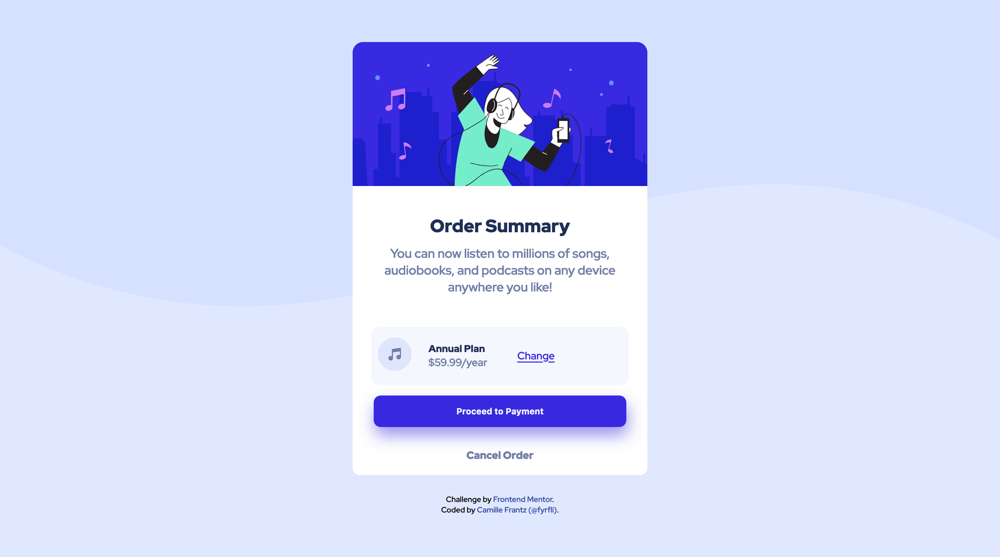
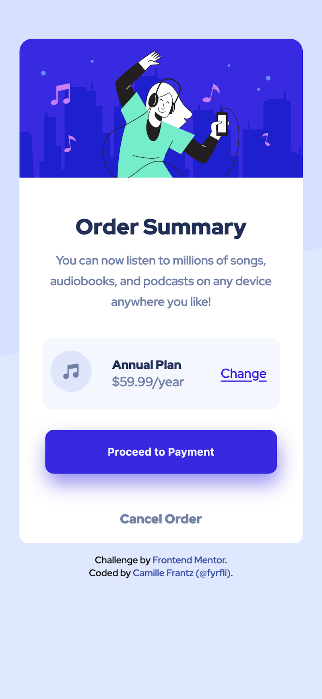

# Frontend Mentor - Order summary card solution

[@fyrfli's](https://github.com/fyrfli) solution to the [Order summary card challenge on Frontend Mentor](https://www.frontendmentor.io/challenges/order-summary-component-QlPmajDUj). Frontend Mentor challenges help you improve your coding skills by building realistic projects. 

## Table of contents

- [Overview](#overview)
  - [The challenge](#the-challenge)
  - [Screenshot](#screenshot)
  - [Links](#links)
- [My process](#my-process)
  - [Built with](#built-with)
  - [What I learned](#what-i-learned)
  - [Continued development](#continued-development)
  - [Useful resources](#useful-resources)
- [Author](#author)
- [Acknowledgments](#acknowledgments)

## Overview

I decided to stop my difficulty down to newbie and try my hand out at something easier. This challenge was to display an order summary with interactive elements. For that, I scaled the checkout button only. I didn't want to overwhelm with all sorts of fancy animations for other portions of the page. 

### The challenge

Users should be able to:

- See hover states for interactive elements

### Screenshot

#### Desktop screenshot

#### Mobile screenshot

### Links

- Solution URL: [Github repository](https://github.com/fyrfli/order-summary-component)
- Live Site URL: [Live site](https://github.io/fyrfli/order-summary-component)

## My process

I designed this with a mobile first approach - getting the page looking presentable in a responsive layout before altering the page with an @media query for desktop.

### Built with

- Semantic HTML5 markup
- CSS custom properties
- Flexbox
- CSS Grid
- Mobile-first workflow

### What I learned

One thing I learned with this challenge is that transforms don't necessarily show up in a mobile verions of the page.

### Useful resources
I used one resource for this challenge: 

- [MDN](https://developer.mozilla.org) - The Mozilla Developer Network.
## Author

- Website - [Camille Frantz \(@fyrfli\)](https://github.com/fyrfli/)
- Frontend Mentor - [@fyrfli](https://www.frontendmentor.io/profile/fyrfli)
- Twitter - [@fyrfli](https://www.twitter.com/fyrfli)

## Acknowledgments

I just want to acknowledge [Grace](https://www.frontendmentor.io/profile/grace-snow) for giving me solid and very very valuable insight on my [Clipboard Landing Page](https://www.frontendmentor.io/solutions/fyrflis-solution-to-the-clipboard-landing-page-challenge-YzrqlHbHF#comment-621828a2145c6a78f071e636) that motivated me to go back to some basics. 

Thanks Grace. I appreciate you.
